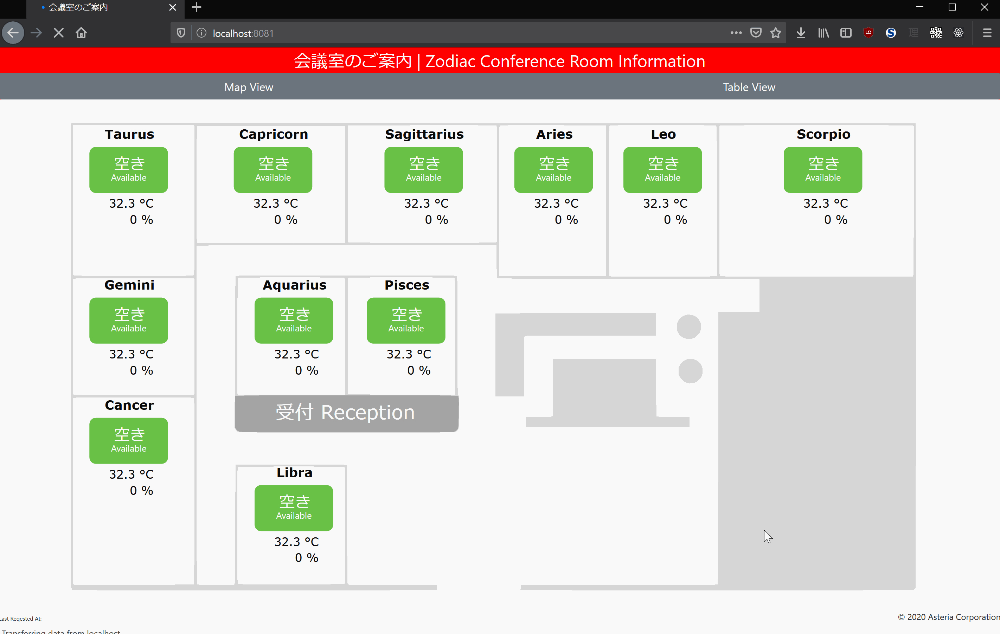
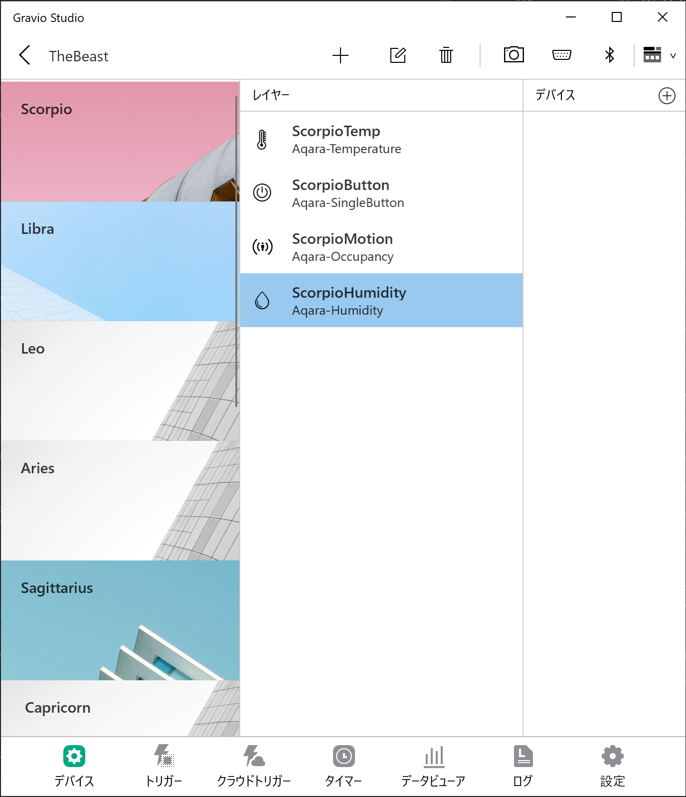

# Zodiac Demo



## Set Up

### Prerequisites

* Python3.6+
* Gravio Hubkit

### Setting up the Server

1. Ensure that Hubkit is up and running and has the following 11 Areas set up.
You can have as many or as few as you like, but the names must be exact matches.
    * Scorpio
    * Libra
    * Leo
    * Aries
    * Sagittarius
    * Capricorn
    * Taurus
    * Gemini
    * Cancer
    * Aquarius
    * Pisces

1. Each room can have the following layer types. Set up as many or as few as you like. Other layer types are ignored.
    * Aqara-Humidity
    * Aqara-Temperature
    * Aqara-SingleButton
    * Aqara-Occupancy

    For example:
    <br/><br/>
    

1. Ensure the devices are properly bound to each layer, and enabled.
1. There is no need to add any Triggers, or Actions. Fetching of data is handled automatically by the Python server.

## Running the Server
1. Take note of your Hubkit's IP Address. If running on the same machine, ignore this step.
1. Open up a terminal, navigate to the source folder and run the following:

    ```shell
    python3 echo3.py
    ```
    or
    ```shell
    python3 echo3.py --port {port} --bind {bindurl} --url {hubkiturl}
    ```

Be default the server launches on localhost:8081


## Architecture

### Client
#### Graphics
The layout is currently a hardcoded SVG path found under the `AddFloor()` method.
In the future, loading from an actual SVG file would be preferred.

#### Settings Variables
Server ping happens every 5 seconds, adjustable via the  `src/main.js:FETCH_LATEST_FROM_SERVER_SECS` parameter.

The Occupancy Sensor has an automatic timeout built into it, by default set to `2 * FETCH_LATEST_FROM_SERVER_SECS`, or 10 seconds. This ensures that the sensor will remain active between server pings. This field is available ` src/main.js:OCCUPANCY_TIMEOUT_SECS`.

### Server
